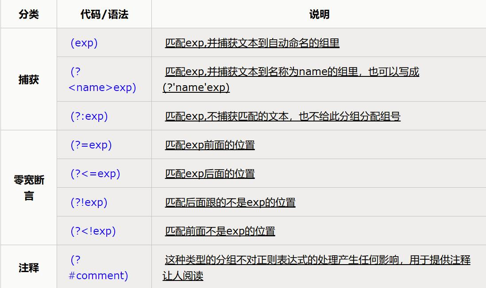

### 正则表达式
常用来检索、替换那些符合某个模式的文本。
[文章摘自](http://www.cnblogs.com/deerchao/archive/2006/08/24/zhengzhe30fengzhongjiaocheng.html#mission)

***
####  元字符
> .匹配除换行符意外的任意字符 
> \b匹配单词的开始或结束 
> \d匹配数字 
> \s匹配任意的空白符 
> \w匹配字母、数字、下划线、汉字 
> ^匹配字符串的开始 
> $匹配字符串的结束 

`ps：使用^和$，表示匹配行的开始处和结束处。
       如：要求填写的QQ号必须为5位到12位时，可以使用^\d{5,12}$。
       因为使用了^和$所以整个字符串都要和\d{5,12}进行匹配。
       如果不加^和$，匹配只能保证字符串里包含5到12连续位数字，
       而不是整个字符串就是5到12位数字。`

___
       
####  字符转义
如果想查找元字符本身，就得使用\来取消这些字符的特殊意义。 
如：查找.和*对应的方式为：\\.和\*；查找\本身，需要使用\\\。

`例子：` 
`unibetter\.com匹配unibetter.com` 
`C:\\windows匹配C:\windows`

***

####  重复
> *重复零次或更多次 
> +重复1次或更多次 
> ?重复0次或1次 
> {n}重复n次 
> {n,}重复n次或更多次 
> {n,m}重复n到m次 

`例子：` 
`Windows\d+ 匹配Windows后面跟1个或更多个数字` 
`^\w+匹配 <u>一行的第一个单词</u>`

---

####  字符类
要想查找数字，字母或数字，空白是很简单的，因为已经有了对应这些
字符集合的元字符，但是如果想匹配没有预定义元字符的字符集合，
只需要在方括号里列出它们就行了。像[aeiou]就匹配 
<u>任何一个英文元音字母</u>，[,?!]匹配 <u>标点符号(.或?或!)</u> 

[0-9]代表的含义与\d就是完全一致：<u>一位数字</u>； 
[a-zA-Z0-9_]代表的含义与\w一致。 

`例子：` 
匹配电话号码，如：(010)88886666或022-22334455或02912345678。 
匹配表达式：\\(?0\d{2}[)-]?\d{8} 
解释：<u>\\(?</u> 表示：\\(将(转义，它能出现0次或1次；然后是0；
后边跟着2个数字<u>\d{2}</u>；然后是)或-中的一个，它出现1次或者
不出现<u>[)-]?</u>；最后是8个数字<u>\d{8}</u>。

---

####  分支条件

上个匹配电话的例子也能匹配010)1234567或(022-87654321这样不正确的格式。
要解决这个问题，我们需要用到**分支条件**。正则表达式里的**分支条件**指的是
有几种规则，如果满足其中任意一种规则都应该成功匹配。具体方法是用
|把不同的规则分隔开。 

>例子： 
    0\d{2}-\d{8}|0\d{3}-\d{7} 这个表达式能 <u>匹配两种以连字号分割的电话号码：
    一种是三位区号，8位本地号（如010-12345678），一种是4位区号，
    7位本地号（0376-2233445）</u>。 
    \d{5}-\d{4}|\d{5} 这个表达式用于匹配美国的邮政编码。使用这个例子是因为它
    能说明一个问题：**使用分支条件时，要注意各个条件的顺序**。
    如果把它改成\d{5}|\d{5}-\d{4}的话，那么就只会匹配5位的
    邮编（以及9位邮编的前5位）。原因是：**匹配分值条件时，将会从左到右地
    测试每个条件，如果满足了某个分支的话，就不会去管其它的条件**。
    
---

####  分组

重复单个字符：直接在字符后面加上限定符就行了 
重复多个字符：用小括号来指定子表达式(也叫做分组)

> 匹配IP地址： 
> IP地址：255:255:255:255 
> ((2[0-4]\d|25[0-5]|[01]?\d\d?)\.){3}(2[0-4]\d|25[0-5]|[01]?\d\d?)

---

####  反义

> \W匹配任意不是字母，数字，下划线，汉字的字符 
> \S匹配任意不是空白符的字符 
> \D匹配任意非数字的字符 
> \B 匹配不是单词开头或结束的位置 
> [^x]匹配除了x以外的任意字符 
> [^aeiou]匹配除了aeiou这几个字母以外的任意字符 

`例子：` 
`\S+匹配 不包含空白符的字符串。` 
`<a[^>]+>匹配 用尖括号括起来的以a开头的字符串。` 

---

####  后向引用
用于重复搜索前面某个分组匹配的文本。

