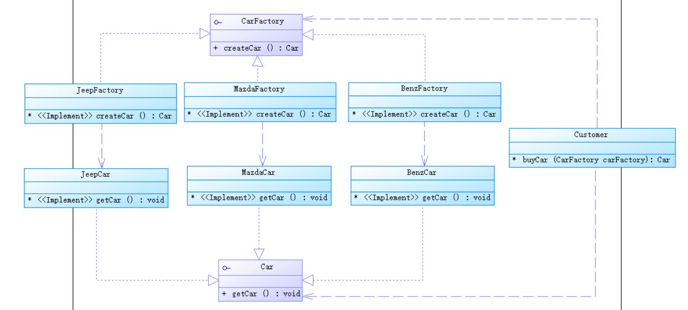

内容摘自网络，仅学习。

### 目录

---
* 工厂方法模式（Factory Method Pattern）
    * <a href="#2">模式定义</a></br>
    * <a href="#3">模式结构</a></br>
    * <a href="#4">时序图</a></br>
    * <a href="#5">代码</a></br>
    * <a href="#6">模式分析</a></br>
    * <a href="#7">实例</a></br>
    * <a href="#8">优点</a></br>
    * <a href="#9">缺点</a></br>
    * <a href="#11">模式应用</a></br>
    * <a href="#13">总结</a></br>
---

### <a name="2">模式定义</a></br>
工厂方法模式又称为工厂模式，也叫虚拟构造器模式或者多态工厂模式，
它属于类创建型模式。在工厂方法模式中，工厂父类负责定义创建产品对象的公共接口，
而工厂子类负责生成具体的产品对象，这样做的目的是将产品类的实例化操作延迟到工厂子类中完成，
即通过工厂子类来确定究竟应该实例化哪一个具体产品类。</br>
PS：目的是获取具体产品；而获取产品需要先创建具体工厂，工厂再产出具体产品。
### <a name="3">模式结构</a></br>
工厂方法模式包含如下角色：</br>
* Product：抽象产品
* ConcreteProduct：具体产品
* Factory：抽象工厂
* ConcreteFactory：具体工厂

### <a name="4">时序图</a></br>

### <a name="5">代码</a></br>
抽象工厂代码
```
public interface CarFactory {
    //工厂方法
    Car createCar();
}
```
抽象产品代码
```
public interface Car {
    void getCar();
}
```
具体工厂代码
```
public class JeepFactory implements CarFactory {
    @Override
    public Car createCar() {
        JeepCar jeepCar = new JeepCar();
        jeepCar.getCar();
        return jeepCar;
    }
}

public class MazdaFactory implements CarFactory {
    @Override
    public Car createCar() {
        MazdaCar mazdaCar = new MazdaCar();
        mazdaCar.getCar();
        return mazdaCar;
    }
}

public class BenzFactory implements CarFactory {
    @Override
    public Car createCar() {
        BenzCar benzCar = new BenzCar();
        benzCar.getCar();
        return benzCar;
    }
}
```
具体产品代码
```
public class JeepCar implements Car {
    @Override
    public void getCar() {
        System.out.println("这是一辆Jeep");
    }
}

public class MazdaCar implements Car {

    @Override
    public void getCar() {
        System.out.println("这是一辆Mazda");
    }
}

public class BenzCar implements Car {
    @Override
    public void getCar() {
        System.out.println("这是一辆Benz");
    }
}
```
客户代码
```
public class Customer {

    /**
     * 买车
     * @param carFactory
     * @return
     */
    public Car buyCar(CarFactory carFactory){
        return carFactory.createCar();
    }

    public static void main(String[] args) {
        Customer customer = new Customer();
        Car jeep = customer.buyCar(new JeepFactory());
        Car mazda = customer.buyCar(new MazdaFactory());
        Car benz = customer.buyCar(new BenzFactory());
    }
}
```
### <a name="6">模式分析</a></br>
工厂方法模式是简单工厂模式的进一步抽象和推广。
由于使用了面向对象的多态性，工厂方法模式保持了简单工厂模式的优点，
而且克服了它的缺点。在工厂方法模式中，核心的工厂类不再负责所有产品的创建，
而是将具体创建工作交给子类去做，这个核心类仅仅负责给出具体工厂必须实现的接口，
而不负责哪一个产品类被实例化这种细节，
这使得工厂方法模式可以允许系统在不修改工厂角色的情况下引进新产品。
### <a name="8">优点</a></br>
* 在工厂方法模式中，工厂方法用来创建客户所需要的产品，
同时还向客户隐藏了哪种具体产品类将被实例化这一细节，用户只需要关心所需产品对应的工厂，
无须关心创建细节，甚至无须知道具体产品类的类名。
* **基于工厂角色和产品角色的多态性设计是工厂方法模式的关键。**
它能够使工厂可以自主确定创建何种产品对象，
而如何创建这个对象的细节则完全封装在具体工厂内部。
**工厂方法模式之所以又被称为多态工厂模式，是因为所有的具体工厂类都具有同一抽象父类。**
* 完全符合“开闭原则”。使用工厂方法模式时，在系统中加入新产品时，
无须修改抽象工厂和抽象产品提供的接口，无须修改客户端，
也无需修改其他的具体工厂和具体产品，而只要添加一个具体工厂和具体产品就可以了。
### <a name="9">缺点</a></br>
* 增加了系统复杂度。</br>
在添加新产品时，需要新编写具体产品类和具体工厂类，使系统中累的个数成对增加。
* 由于考虑到系统的可扩展性，需要引入抽象层，在客户端代码中均使用抽象层进行定义，
增加了系统的抽象性和理解难度，且在实现时可能需要用到DOM、反射等技术，
增加了系统的实现难度。
### <a name="11">模式应用</a></br>
JDBC中的工厂方法：
```
Connection conn=DriverManager.getConnection("jdbc:microsoft:sqlserver://loc
alhost:1433; DatabaseName=DB;user=sa;password="); //调用工厂类，获取产品类
Statement statement=conn.createStatement();
ResultSet rs=statement.executeQuery("select * from UserInfo");
```
### <a name="13">总结</a></br>
* 工厂方法模式又称为工厂模式，它属于类创建型模式。在工厂方法模式中，
工厂父类负责定义创建产品对象的公共接口，而工厂子类则负责生成具体的产品对象，
这样做的目的是将产品类的实例化操作延迟到工厂子类中完成，
即通过工厂子类来确定究竟应该实例化哪一个具体产品类。

* 工厂方法模式包含四个角色：
    * 抽象产品是定义产品的接口，是工厂方法模式所创建对象的超类型，即产品对象的共同父类或接口；
    * 具体产品实现了抽象产品接口，某种类型的具体产品由专门的具体工厂创建，
    它们之间往往一一对应；
    * 抽象工厂中声明了工厂方法，用于返回一个产品，它是工厂方法模式的核心，
    任何在模式中创建对象的工厂类都必须实现该接口；
    * 具体工厂是抽象工厂类的子类，实现了抽象工厂中定义的工厂方法，并可由客户调用，
    返回一个具体产品类的实例。
    
* 工厂方法模式是简单工厂模式的进一步抽象和推广。
由于使用了面向对象的多态性，工厂方法模式保持了简单工厂模式的优点，
而且克服了它的缺点。在工厂方法模式中，核心的工厂类不再负责所有产品的创建，
而是将具体创建工作交给子类去做。这个核心类仅仅负责给出具体工厂必须实现的接口，
而不负责产品类被实例化这种细节，
这使得工厂方法模式可以允许系统在不修改工厂角色的情况下引进新产品。

* 工厂方法模式的主要优点是增加新的产品类时无须修改现有系统，
并封装了产品对象的创建细节，系统具有良好的灵活性和可扩展性；
其缺点在于增加新产品的同时需要增加新的工厂，导致系统类的个数成对增加，
在一定程度上增加了系统的复杂性。

* 工厂方法模式适用情况包括：</br>
    * 一个类不知道它所需要的对象的类；
    * 一个类通过其子类来指定创建哪个对象；
    * 将创建对象的任务委托给多个工厂子类中的某一个，
客户端在使用时可以无须关心是哪一个工厂子类创建产品子类，需要时再动态指定。