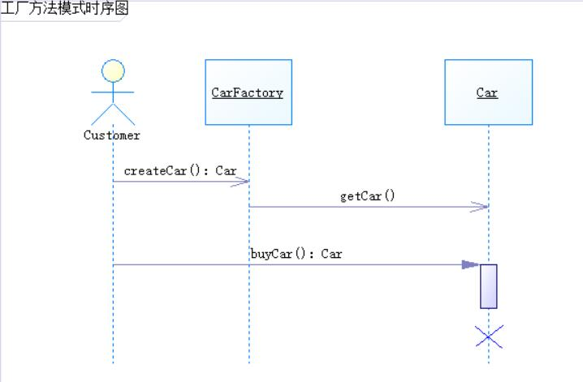

内容摘自网络，仅学习。

### 目录

---
* 工厂方法模式（Factory Method Pattern）
    * <a href="#2">模式定义</a></br>
    * <a href="#3">模式结构</a></br>
    * <a href="#4">时序图</a></br>
    * <a href="#5">代码</a></br>
    * <a href="#6">模式分析</a></br>
    * <a href="#7">实例</a></br>
    * <a href="#8">优点</a></br>
    * <a href="#9">缺点</a></br>
    * <a href="#10">适用环境</a></br>
    * <a href="#11">模式应用</a></br>
    * <a href="#12">模式扩展</a></br>
    * <a href="#13">总结</a></br>
---

### <a name="2">模式定义</a></br>
工厂方法模式又称为工厂模式，也叫虚拟构造器模式或者多态工厂模式，
它属于类创建型模式。在工厂方法模式中，工厂父类负责定义创建产品对象的公共接口，
而工厂子类负责生成具体的产品对象，这样做的目的是将产品类的实例化操作延迟到工厂子类中完成，
即通过工厂子类来确定究竟应该实例化哪一个具体产品类。</br>
PS：目的是获取具体产品；而获取产品需要先创建具体工厂，工厂再产出具体产品。
### <a name="3">模式结构</a></br>
工厂方法模式包含如下角色：</br>
* Product：抽象产品
* ConcreteProduct：具体产品
* Factory：抽象工厂
* ConcreteFactory：具体工厂

### <a name="4">时序图</a></br>

### <a name="5">代码</a></br>
抽象工厂代码
```
public interface CarFactory {
    Car createCar();
}
```
抽象产品代码
```
public interface Car {
    void getCar();
}
```
具体工厂代码
```
public class JeepFactory implements CarFactory {
    @Override
    public Car createCar() {
        JeepCar jeepCar = new JeepCar();
        jeepCar.getCar();
        return jeepCar;
    }
}

public class MazdaFactory implements CarFactory {
    @Override
    public Car createCar() {
        MazdaCar mazdaCar = new MazdaCar();
        mazdaCar.getCar();
        return mazdaCar;
    }
}

public class BenzFactory implements CarFactory {
    @Override
    public Car createCar() {
        BenzCar benzCar = new BenzCar();
        benzCar.getCar();
        return benzCar;
    }
}
```
具体产品代码
```
public class JeepCar implements Car {
    @Override
    public void getCar() {
        System.out.println("这是一辆Jeep");
    }
}

public class MazdaCar implements Car {

    @Override
    public void getCar() {
        System.out.println("这是一辆Mazda");
    }
}

public class BenzCar implements Car {
    @Override
    public void getCar() {
        System.out.println("这是一辆Benz");
    }
}
```
客户代码
```
public class Customer {

    /**
     * 买车
     * @param carFactory
     * @return
     */
    public Car buyCar(CarFactory carFactory){
        return carFactory.createCar();
    }

    public static void main(String[] args) {
        Customer customer = new Customer();
        Car jeep = customer.buyCar(new JeepFactory());
        Car mazda = customer.buyCar(new MazdaFactory());
        Car benz = customer.buyCar(new BenzFactory());
    }
}
```
### <a name="6">模式分析</a></br>
### <a name="7">实例</a></br>
### <a name="8">优点</a></br>
### <a name="9">缺点</a></br>
### <a name="10">适用环境</a></br>
### <a name="11">模式应用</a></br>
### <a name="12">模式扩展</a></br>
### <a name="13">总结</a></br>