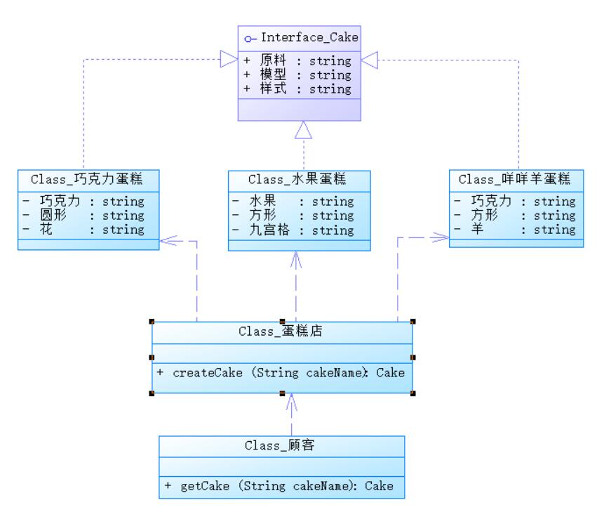

文本内容均是从网络查找，经过自己的理解然后转化为这篇文章。

<a href="#1">简单工厂模式介绍</a> 
<a href="#2">解决问题</a> 
<a href="#3">应用场景</a> 
<a href="#4">工厂模式分析</a> 
<a href="#5">代码</a> 
<a href="#6">优点</a> 
<a href="#7">缺点</a> 
<a href="#8">Java中的应用</a> 
<a href="#9">总结</a> 

### <a name="1">简单工厂模式介绍</a>

---
简单工厂模式又叫静态工厂模式，并不是23中常用设计模式之一，只算是工厂模式
的一个特殊实现。相比工厂方法模式和抽象工厂模式使用少得多，因为它只适应
一些简单的情况。

### <a name="2">解决问题</a>

---
### <a name="3">应用场景</a>

---

### <a name="4">工厂模式分析</a>

---
### <a name="5">优点</a>

---
### <a name="6">缺点</a>

---
### <a name="7">代码</a>

---
### <a name="8">Java中的应用</a>

---
### <a name="9">总结</a>

---

