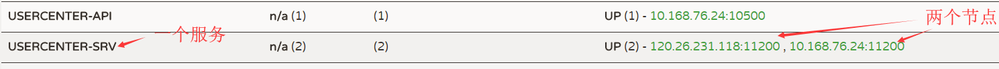
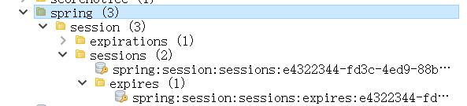

### 操作

---
一、在SpringCloud WEB项目中引入jar包。
    
    <!-- data redis -->
    <dependency>
        <groupId>org.springframework.boot</groupId>
        <artifactId>spring-boot-starter-data-redis</artifactId>
    </dependency>
    
    <!-- spring session -->
    <dependency>
        <groupId>org.springframework.session</groupId>
        <artifactId>spring-session</artifactId>
    </dependency>
    <!-- spring session redis -->
    <dependency>
        <groupId>org.springframework.session</groupId>
        <artifactId>spring-session-data-redis</artifactId>
    </dependency>
    
    
二、配置SpringSession和Redis

1、创建配置类（类名随意）

关键是两个注解
* @Configuration    用于定义配置类
* @EnableRedisHttpSession   开启缓存HttpSession（默认有效时间为1800s）

    @Configuration
    @EnableRedisHttpSession
    public class SessionConfig {
    }

2、在yml中配置redis

    spring:
      redis:
        host: 127.0.0.1
        port: 6379
        password: **** # redis密码
        timeout: 3000 #连接超时时间 单位 ms毫秒
        pool:
          max-idle: 8 #连接池中最大空闲连接，默认值也是8
          min-idle: 0 #连接池中最小空闲连接，默认值也是0
          max-active: 8 #如果赋值为-1，则表示不限制；如果pool已经分配了maxActive个jedis实例，则此时pool的状态为exhausted（耗尽）
          max-wait: -1  #等待可用连接的最大时间，单位毫秒，默认值为-1，表示永不超时。如果超时等待时间，则直接抛出
          
          
三、负载均衡（仅说的是方式，SpringCloud没必要使用Nginx实现负载均衡，
因为它本身已经具备）

1、使用SpringCloud的Feign实现负载均衡（整合了Ribbon）
        
    将上述的SpringCloud项目，分别以不同的端口号，启动两个；此时，
    在Eureka中注册的这个服务会有两个节点（同一个serviceId会有两个节点）。
    

2、使用Nginx实现负载均衡
    
   I、在Nginx的配置文件中配置负载均衡
   
       http {
           # upstream 配置负载均衡
           upstream serverName {  # serverName 随便起，注意不能有_
               server 127.0.0.1:8801; # 负载均衡的目标服务节点1，端口8801
               server 127.0.0.1:8802; # 负载均衡的目标服务节点2，端口8802
           }
           
           server {
               listen 9000;
               location / {
                    proxy_pass http://serverName; # upStream配置的负载均衡名称
               }
           }
       }
       
   II、将项目分别以步骤I中的端口8801和8802启动项目
   
四、测试

调用服务时，会往Redis中存入session信息；节点不同也是同一个session。

